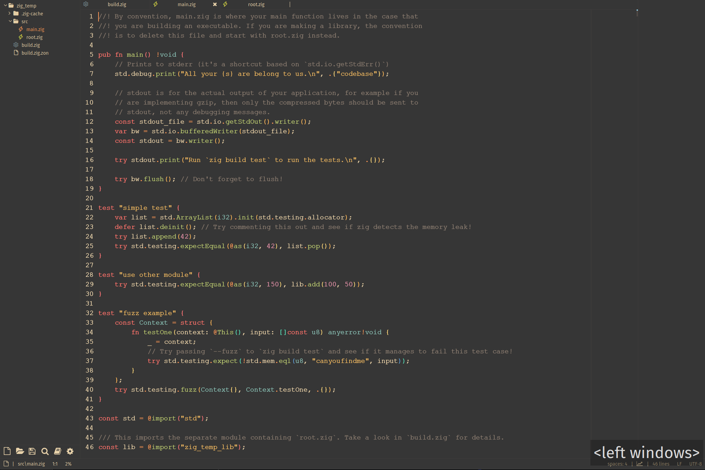

# sirlilpandas config

This is my standard config, it uses gruvbox theme in `panda_box.lua` and has two syntaxes for c and cpp in 
`panda_language_c` and `panda_language_cpp` respectively. Below are the commands used to install this config
on a new system, these will also installs addtional plugins found in plugins.txt including the ones defined
in this repo.

your old `init.lua` will be saved to a `init.lua` in the `$HOME/.config/lite-xl/` dir.



## requirements to install

- [`lite-xl`](https://lite-xl.com/)
- [`lpm`](https://github.com/lite-xl/lite-xl-plugin-manager)

## how to install:

### *.nix
```console

# gets the theme and both language syntaxes
$ lpm repo add https://github.com/sirlilpanda/.lite-xl-config:main

# installs all the plugins i normally used font in plugins.txt
$ lpm install `(curl https://raw.githubusercontent.com/sirlilpanda/.lite-xl-config/refs/heads/main/plugins.txt)`

# updates the current user module with my init.lua 
# WARNING THIS WILL OVERWRITE YOUR init.lua
$ cp $HOME/.config/lite-xl/init.lu/ $HOME/.config/lit/-xl/init_old.lua
$ curl https://raw.githubusercontent.com/sirlilpanda/.lite-xl-config/refs/heads/main/init.lua > $HOME/.config/lite-xl/init.lua

```

### windows
```powershell

# gets the theme and both language syntaxes
> lpm repo add https://github.com/sirlilpanda/.lite-xl-config:main

# installs all the plugins i normally used font in plugins.txt
> ForEach ($line in (Invoke-WebRequest https://raw.githubusercontent.com/sirlilpanda/.lite-xl-config/refs/heads/main/plugins.txt | Select-Object -Expand Content).split()){ lpm install $line}

# updates the current user module with my init.lua 
# this will save your current lua file to a init_old.lua just encase you still need it
> cp $HOME\.config\lite-xl\init.lua $HOME\.config\lite-xl\init_old.lua
# WARNING THIS WILL OVERWRITE YOUR init.lua
> (Invoke-WebRequest https://raw.githubusercontent.com/sirlilpanda/.lite-xl-config/refs/heads/main/init.lua | Select-Object -Expand Content) > $HOME\.config\lite-xl\init.lua
```
